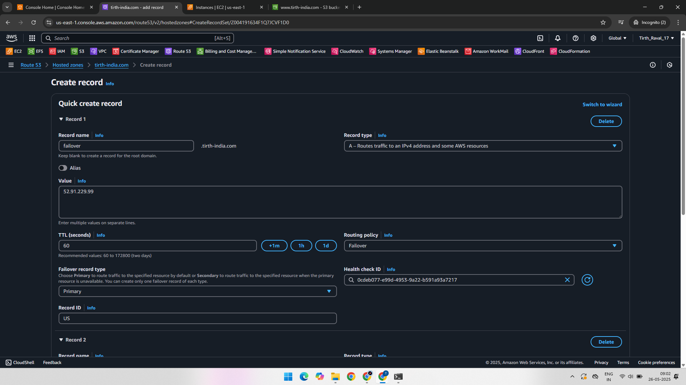
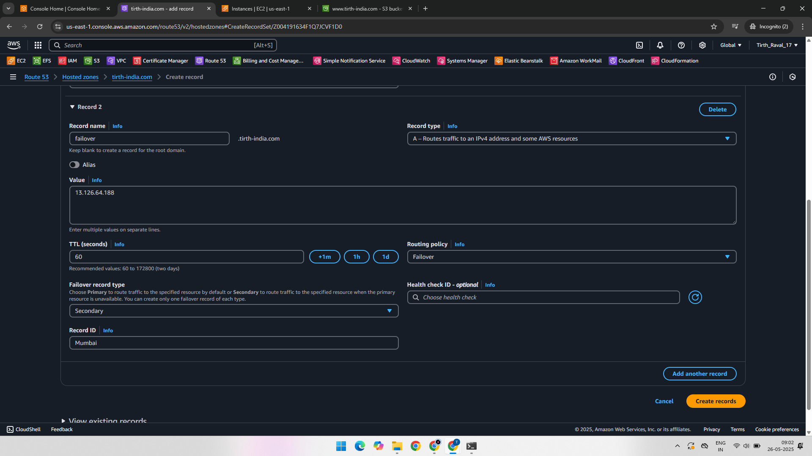
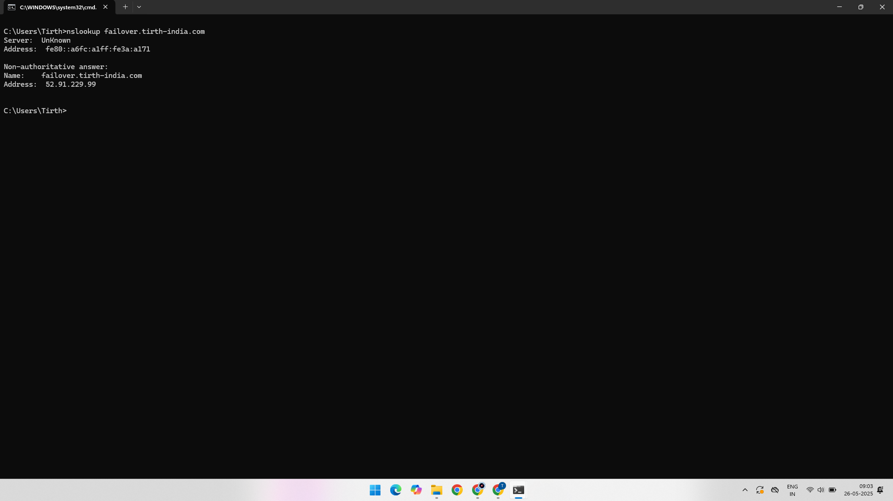
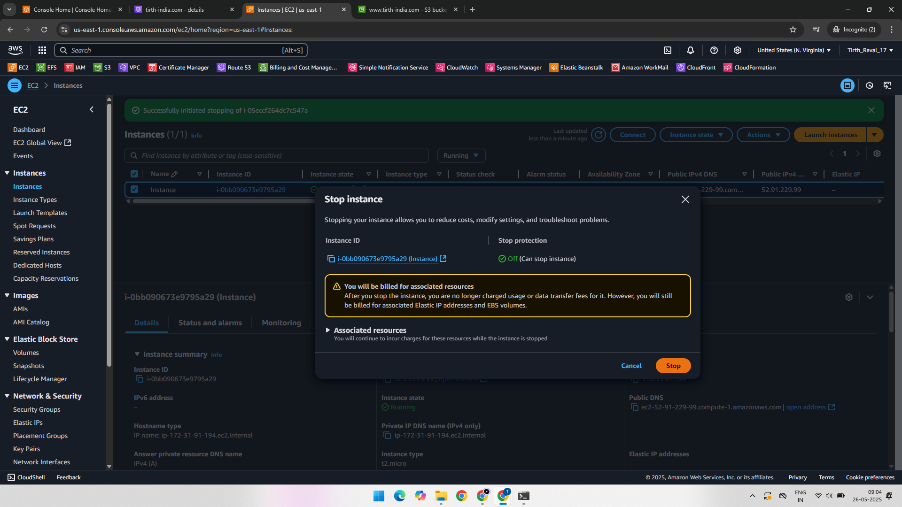

# AWS Route 53 – Failover Routing Policy Practical

This project demonstrates the configuration and testing of **Failover Routing Policy** in **Amazon Route 53**. Failover routing ensures high availability by automatically redirecting DNS traffic to a **secondary EC2 instance** if the **primary instance** becomes unavailable.

---

## 🔗 AWS Services Used

- Amazon EC2  
- Amazon Route 53  
- Route 53 Health Checks  

---

## 🛠️ Practical Overview

1. Launch EC2 instances in two regions (e.g., US and India).
2. Configure Route 53 with **Failover Routing Policy**.
3. Attach a health check to the primary EC2 instance.
4. Test DNS resolution using `nslookup` before and after simulating a failure.

---

### ✅ Step 1: Record 1 – US Region (Primary)

We create an A record in Route 53 pointing to the EC2 instance in the **US region**.  
Routing policy: **Failover – Primary**  
A health check is attached.

---

### ✅ Step 2: Record 2 – India Region (Secondary)

We create a second A record pointing to the EC2 instance in the **India region**.  
Routing policy: **Failover – Secondary**  
No health check is needed.

---

### ✅ Step 3: Testing with Primary Healthy

We use the `nslookup` command to test the domain.  
As the primary is healthy, the DNS resolves to the **US EC2 instance IP**.

---

### ✅ Step 4: Simulating Primary Failure

We manually stop the US EC2 instance to simulate a failure.  
The health check status becomes **unhealthy**.

---

### ✅ Step 5: Testing with Primary Down

We run `nslookup` again.  
Now, DNS resolves to the **India EC2 instance IP**, proving that failover works.

---

## 🧪 Output and Result

- When the primary instance is healthy, users are directed to the **primary (US)** instance.
- If the primary fails, users are automatically routed to the **secondary (India)** instance.

---

## 📚 Learning Outcome

- How to configure **failover routing** in Route 53.
- How to attach a **health check** to monitor EC2 instance status.
- How to test DNS routing behavior using `nslookup`.

---

## 📁 Project Structure

AWS-Route-53-failover-routing/
│
├── 01-Record-1-US-Primary-Failover-Routing.png
├── 02-Record-2-India-Secondary-Failover-Routing.png
├── 03-Checked-In-CMD-Reply-From-Primary.png
├── 04-Stopped-US-Primary-Instance.png
├── 05-Checked-In-CMD-Now-Reply-From-Secondary.png
└── README.md
