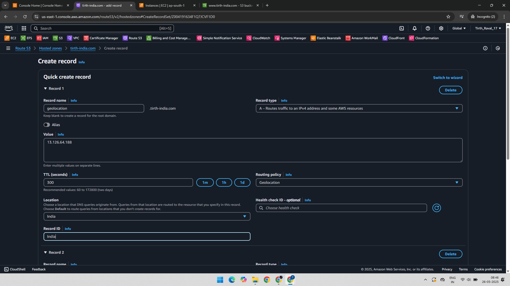
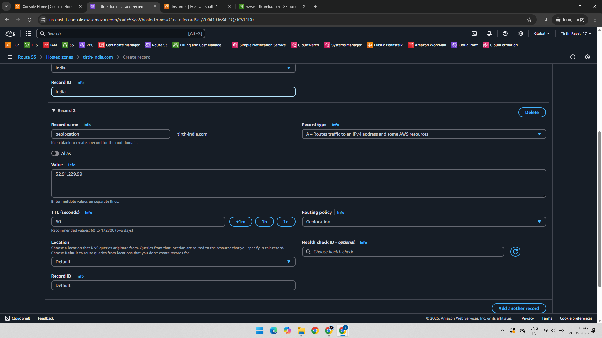
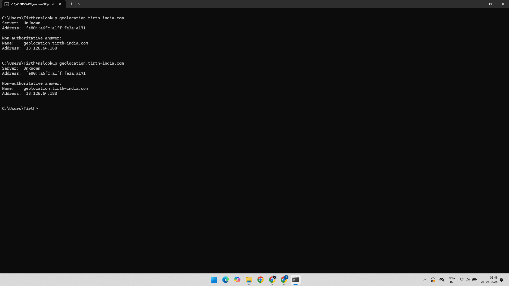
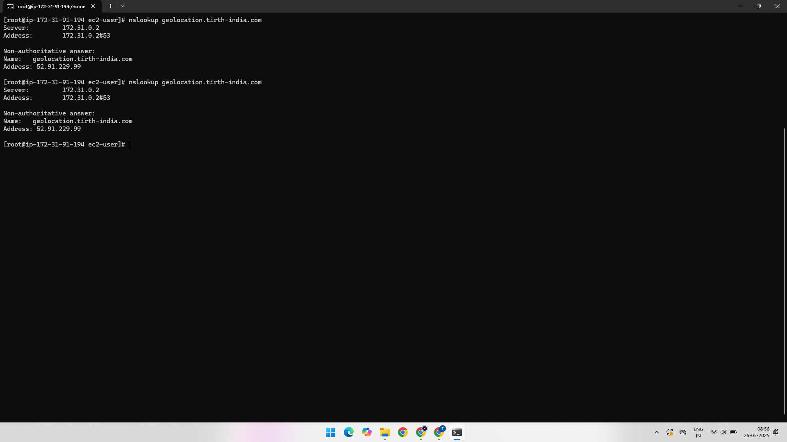

# AWS Route 53 – Geolocation Routing Policy Practical

This project demonstrates how to configure **Geolocation Routing Policy** using **Amazon Route 53** to direct users to different resources based on the geographic location of their IP address.

Geolocation routing helps improve performance, compliance, and localization by serving region-specific content.

---

## 🔗 AWS Services Used

- Amazon EC2
- Amazon Route 53

---

## 🛠️ Practical Overview

1. Create two EC2 instances – one in **Mumbai (India)** and one as the **default** for other regions (like the USA).
2. Configure Route 53 with **geolocation routing**:
   - One record for traffic from India.
   - One default record for all other locations.
3. Test how different IP addresses resolve based on their region.

---

### ✅ Step 1: Record 1 – India (Mumbai Region)

We create an A record in Route 53 to serve Indian users. This record points to the EC2 instance in the Mumbai region.

---

### ✅ Step 2: Record 2 – Default Location (All Other Regions)

We create another A record with a **default** geolocation rule. This will handle all regions not explicitly defined, like the USA.

---

### ✅ Step 3: Testing from India

We test the DNS resolution using an Indian IP address. Route 53 returns the IP from Record 1 (Mumbai region).

---

### ✅ Step 4: Testing from the USA

We test using a US-based IP address. Route 53 returns the IP from the default record.

---

## 🧪 Output and Result

- **Indian users** are directed to the **Mumbai EC2 instance**.
- **Users from other regions (e.g., USA)** are directed to the **default instance**.

This confirms successful geolocation-based DNS resolution using Route 53.

---

## 📚 Learning Outcome

- Understand how Route 53 handles geolocation routing.
- Learn to set region-specific and default DNS records.
- Observe how DNS resolves differently based on the client’s location.

---

## 📁 Project Structure

AWS-Route53-Geolocation-Routing/
│
├── 01-Record-1-Mumbai-Region-IP-Geolocation-Routing.png
├── 02-Record-2-IP-Default-Location-Geolocation-Routing.png
├── 03-Checked-In-India-Region-IP-Gets-From-Record-1.png
├── 04-Checked-In-US-IP-Gets-From-Record-2.png
└── README.md
