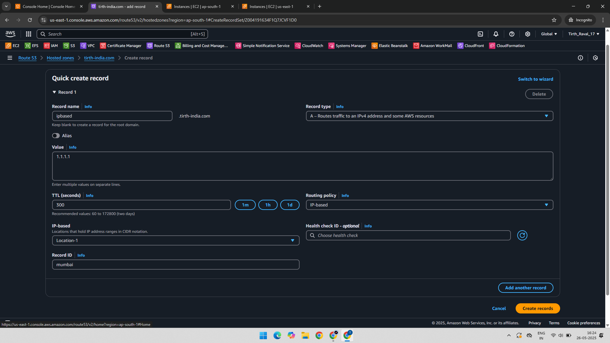
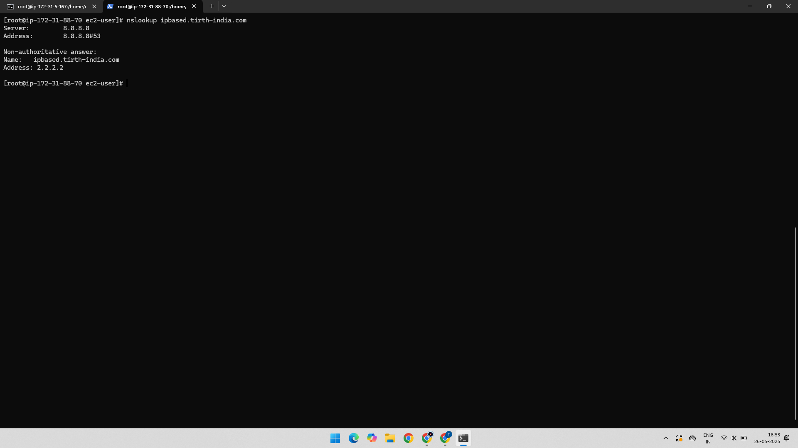

# AWS Route 53 - IP-Based Routing Practical

This practical demonstrates configuring **IP-Based Routing** in AWS Route 53 to route DNS queries to different IP addresses based on the client's geographic location.

---

## 🔗 AWS Services Used

- Amazon Route 53  
- Amazon EC2

---

## 🛠️ Practical Overview
- Create DNS records in Route 53 with IP-based routing.
- Set geographic locations for routing traffic (e.g., Mumbai, US).
- Configure a default record for fallback traffic.
- Validate routing by testing DNS resolution from different locations.

---

### ✅ Step-1. Create Location Routing Setup

- The screenshot shows two geographic locations configured in Route 53.

### ✅ Step-2. Create Mumbai IP Record

- A record pointing to IP `1.1.1.1` is created for Mumbai location.

### ✅ Step-3. Create US IP Record

- A record pointing to IP `2.2.2.2` is created for the US location.

### ✅ Step-4. Create Default IP Record

- Default routing record created pointing to IP `3.3.3.3` for all other locations.

### ✅ Step-5. Verify Mumbai DNS Response

- DNS query from Mumbai resolves to IP `1.1.1.1` as expected.

### ✅ Step-6. Verify US DNS Response

- DNS query from US resolves to IP `2.2.2.2` as expected.

---

📚 Learning Outcome

- How to configure IP-based routing in Route 53.
- How to set geographic location-specific DNS records.
- How to create a default fallback record.
- How to verify DNS responses based on client location.

---

## 📁 Project Structure

AWS-Route53-IPbased-Routing/
├── 01-Created-Two-Location.png
├── 02-Record-1-Mumbai-1.1.1.1.png
├── 03-Record-2-US-2.2.2.2.png
├── 04-Record-3-Default-3.3.3.3.png
├── 05-Checked-In-Mumbai-Reply-From-1.1.1.1.png
├── 06-Checked-In-US-Reply-From-2.2.2.2.png
└── README.md

