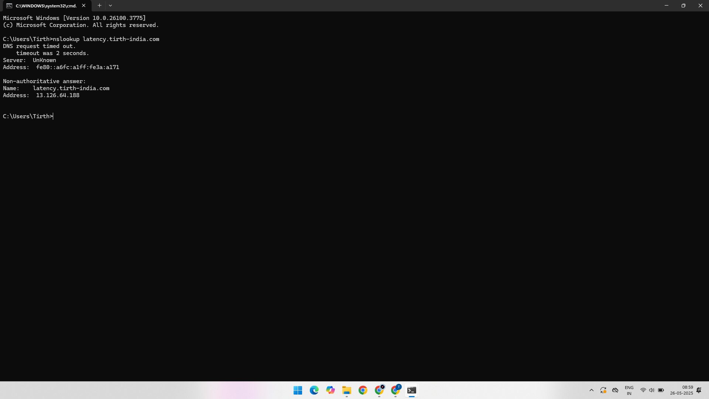

# AWS Route 53 – Latency Routing Policy Practical

This project demonstrates the configuration and testing of **Latency Routing Policy** in **Amazon Route 53**. Latency-based routing helps direct user requests to the region with the **lowest network latency**, providing faster and more responsive experiences.

---

## 🔗 AWS Services Used

- Amazon EC2
- Amazon Route 53

---

## 🛠️ Practical Overview

1. Launch EC2 instances in different regions (e.g., US East and India/Mumbai).
2. Configure Route 53 with latency-based routing to point to each EC2 instance.
3. Test DNS resolution using `nslookup` from different geographical locations to verify which instance is returned based on latency.

---

### ✅ Step 1: Record 1 – US Region (Low Latency for US Users)

We create an A record in Route 53 that maps to an EC2 instance in the US region, using latency routing.

---

### ✅ Step 2: Record 2 – India Region (Low Latency for Indian Users)

We create another A record pointing to an EC2 instance in India (Mumbai region), also using latency routing.

---

### ✅ Step 3: Testing from India

We use a machine in India to run `nslookup`. It receives the IP address of the Indian EC2 instance (Record 2), confirming latency-based routing is functioning correctly.

---

### ✅ Step 4: Testing from the US

We use a US-based IP to test the domain resolution. The response points to the US EC2 instance (Record 1), as expected.

---

## 🧪 Output and Result

- Users from India are directed to the **Mumbai instance**.
- Users from the US are directed to the **US instance**.
- The decision is based on **lowest latency**, not location alone.

---

## 📚 Learning Outcome

- Understand how latency-based routing works in Route 53.
- Learn to set up multiple records for the same domain with latency-based logic.
- Use `nslookup` to observe region-based DNS resolution.

---

## 📁 Project Structure

AWS-Route53-Latency-Routing/
│
├── 01-Record-1-US-IP-Latency-Routing.png
├── 02-Record-2-India-IP-Latency-Routing.png
├── 03-Checked-In-India-Low-Latency-In-Record-2.png
├── 04-Checked-In-US-Low-Latency-In-Record-1.png
└── README.md
