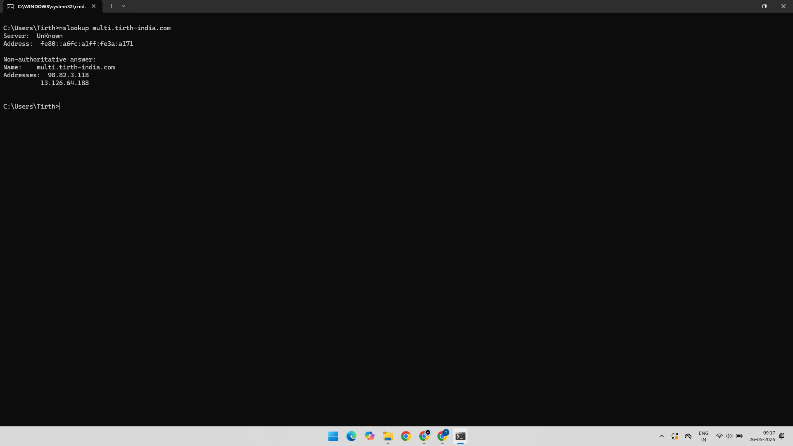

# AWS Route 53 - Multivalue Routing Policy Practical

## Overview
This practical demonstrates how to configure **Multivalue Answer Routing** in **AWS Route 53** to return multiple healthy IP addresses for a DNS query, improving availability and basic load balancing.

---

## 🔗 AWS Services Used

- Amazon EC2  
- Amazon Route 53  
- Route 53 Health Checks  

---

## 🛠️ Practical Overview
- Configure Route 53 with multiple A records using **Multivalue Routing Policy**.
- Attach health checks to each record to ensure only healthy IPs are returned.
- Validate DNS resolution returns multiple IP addresses.
  
---

### ✅ Step-1. Create First Multivalue Routing Record

- The first A record created with Multivalue routing enabled.
- Health check is associated to monitor this IP's health.

### ✅ Step-2. Add Second Multivalue Routing Record

- Second A record is created similarly with a different IP address.
- Both records use Multivalue routing and have health checks.

### ✅ Step-3. Test DNS Resolution via Command Line

- Using `nslookup` on the domain name shows multiple IP addresses returned.
- This confirms multivalue routing is functioning and healthy IPs are returned.

---

## 📚 Learning Outcome

- How to configure **multivalue routing** in Route 53.  
- How to attach **health checks** to DNS records.  
- How to verify DNS responses using `nslookup`.

---

## 📁 Project Structure

AWS-Route53-Multivalue-Routing/
├── 01-Record-1-IP-Multivalue-Routing.png
├── 02-Record-2-IP-Multivalue-Routing.png
├── 03-Checked-In-CMD.png
└── README.md  

