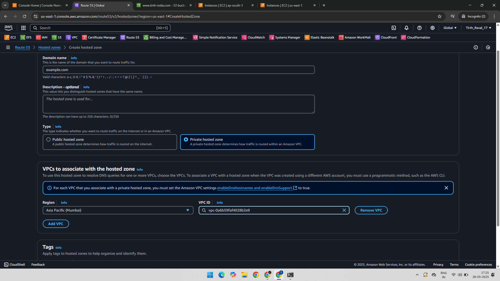
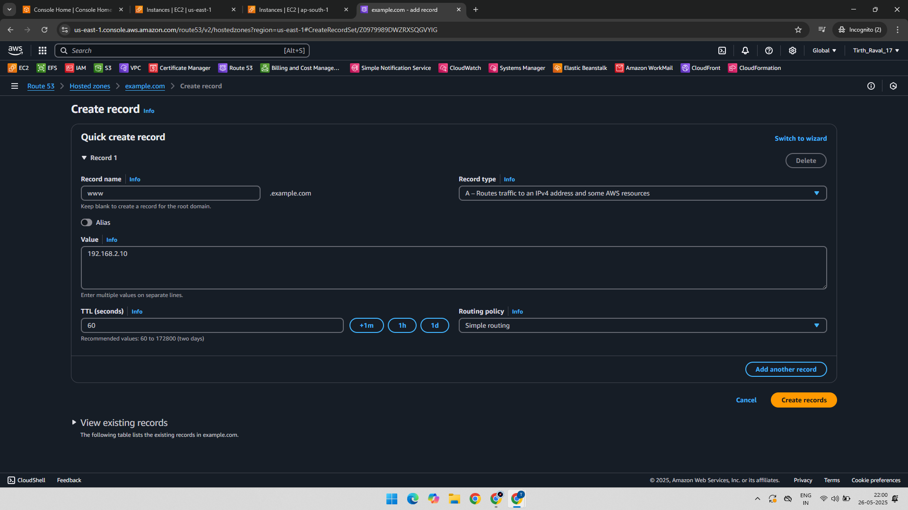

# AWS Route 53 – Private Hosted Zone Practical

This practical demonstrates the use of **Private Hosted Zones** in Route 53 to limit DNS resolution to specific Amazon VPCs. It shows how DNS records are only resolvable from within the VPC(s) associated with the hosted zone and not from outside or unrelated regions.

---

## 🔗 AWS Services Used

- Amazon Route 53  
- Amazon EC2

---

## 🛠️ Practical Overview

- Create a **Private Hosted Zone** associated with a specific VPC in the Mumbai region.
- Verify that the DNS record resolves inside the associated region.
- Confirm that the DNS record does **not** resolve from a different region or unrelated VPC.

---

### ✅ Step-1. Created Private Hosted Zone in Mumbai Region

- A private hosted zone was created and linked to a VPC in the **Mumbai region**.

---

### ✅ Step-2. DNS Record Added in the Private Hosted Zone

- A sample A record was added to the hosted zone for internal resolution.

---

### ✅ Step-3. Checked DNS Resolution from Mumbai Region EC2 Instance

- Successfully resolved the DNS record from within the Mumbai-region VPC.

---

### ✅ Step-4. Checked DNS Resolution from US Region EC2 Instance

- Failed to resolve the DNS record from a US-region instance, proving that the hosted zone is private to the associated VPC only.

---

📚 Learning Outcome
- How to create a Private Hosted Zone in Route 53.
- How to associate it with a specific VPC.
- How to add DNS records visible only inside the VPC.
- How to test restricted DNS visibility using EC2 instances in different regions.

---

## 📁 Project Structure

AWS-Route53-Private-Hosted-Zone/
├── 01-Private-Hosted-Zone-Mumbai-Region-VPC.png
├── 02-Record-Created-In-Private-Hosted-Zone.png
├── 03-Checked-In-Mumbai-Region-Shows-The-Record.png
├── 04-Checked-In-US-Region-Failed-To-Show-Record.png
└── README.md

