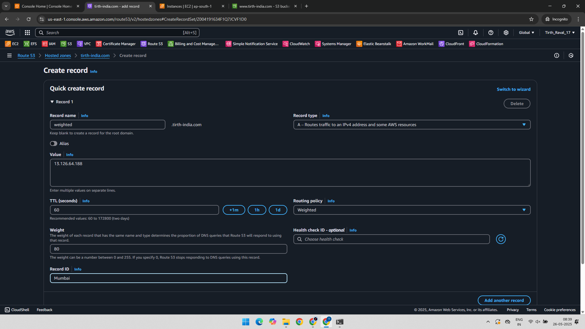
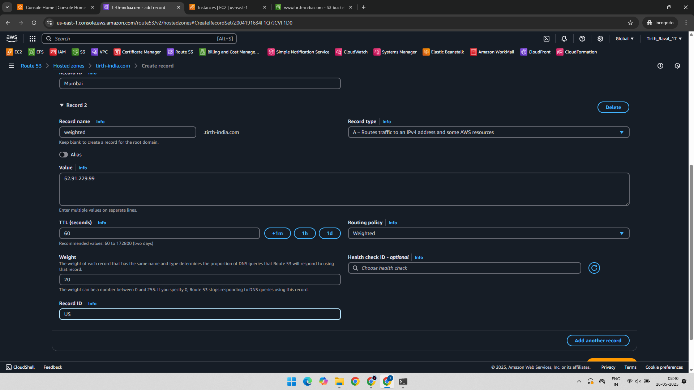
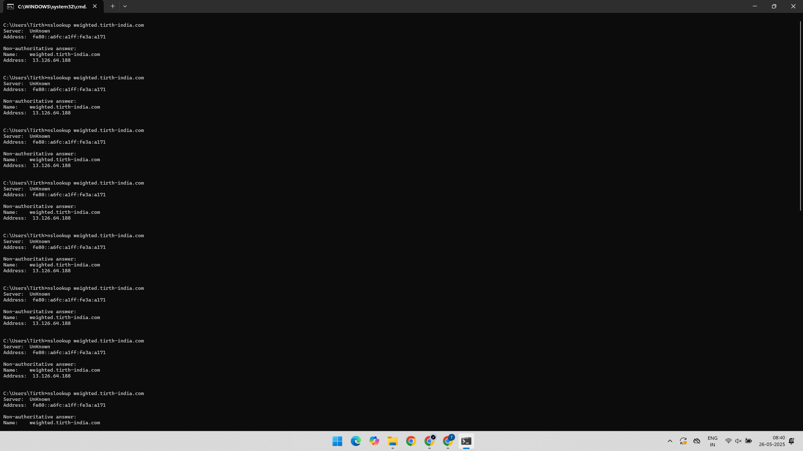

# AWS Route 53 – Weighted Routing Policy Practical

This project demonstrates how to configure **Weighted Routing Policy** using **Amazon Route 53** to distribute traffic across multiple EC2 instances.

Weighted routing allows you to associate multiple resources with a single domain name and control the proportion of traffic that is routed to each resource.

---

## 🔗 AWS Services Used

- Amazon EC2
- Amazon Route 53

---

## 🛠️ Practical Overview

1. Create two EC2 instances in different regions or availability zones.
2. Create two A records in Route 53 with different weights.
3. Test the routing behavior using the command line (`nslookup`).

---

### ✅ Step 1: Record 1 - Weighted Routing

We create the first A record in Route 53 pointing to the first EC2 instance with a weight (e.g., 80%).

---

### ✅ Step 2: Record 2 - Weighted Routing

We add the second A record pointing to the second EC2 instance with a different weight (e.g., 20%).

---

### ✅ Step 3: Testing Weighted Routing from Command Line

Using `nslookup`, we observe how Route 53 resolves the domain name with respect to the configured weight.

---

## 🧪 Output and Result

When multiple DNS queries are made, the domain resolves to one of the IP addresses based on the assigned weights. For instance:
- 80% of the traffic will go to the IP of Record 1.
- 20% will go to the IP of Record 2.

This demonstrates successful **Weighted Routing** configuration.

---

## 📚 Learning Outcome

- Understand the use case of Route 53 Weighted Routing.
- Configure multiple DNS records with weighted distribution.
- Validate traffic flow using command-line tools.

---

## 📁 Project Structure

AWS-Route53-Weighted-Routing/
│
├── 01-Record-1-Weighted-Routing.png
├── 02-Record-2-Weighted-Routing.png
├── 03-Checked-in-CMD.png
└── README.md
