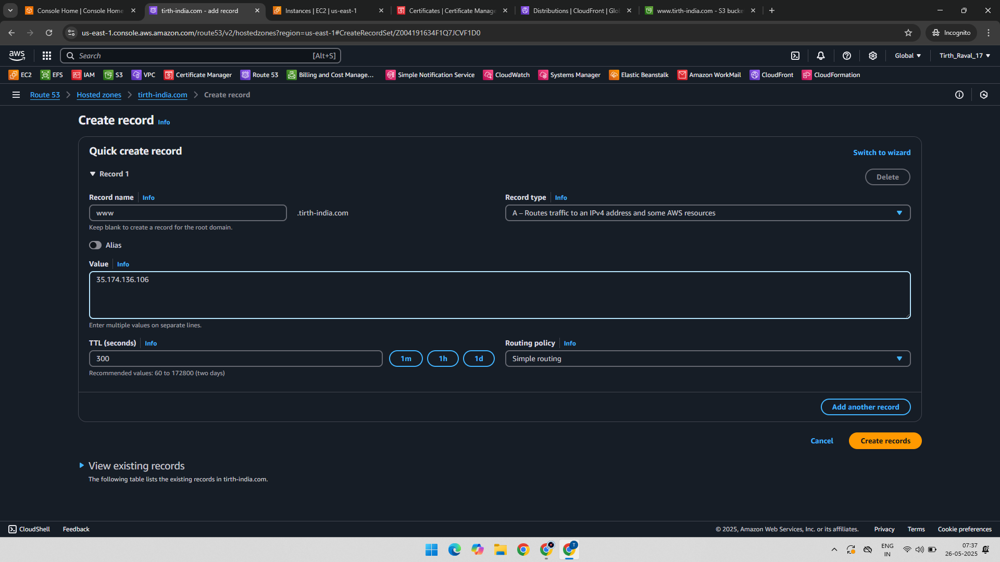
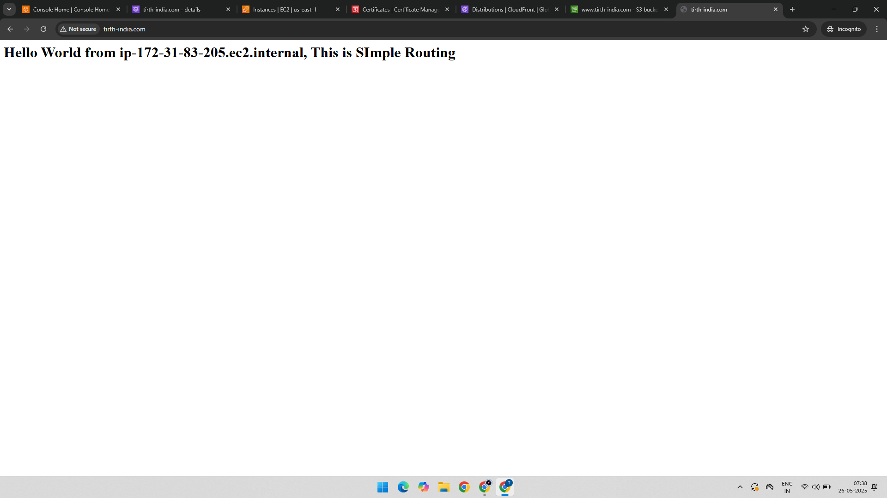

# 🌐 Route 53 Project-2: Simple Routing Record in Route53

This project showcases how to use **Amazon Route 53 Simple Routing** to connect a domain to an **EC2 instance**.  A public IP of the EC2 instance was mapped using an **A record** in Route 53.  The setup enables users to access the EC2-hosted website through a domain name.

---

### 🧰 Services Used:
- Amazon EC2  
- Amazon Route 53  
- Web Browser (for validation)

---

### 🔧 Project Goals:
- Create an A Record using Simple Routing
- Point the record to an EC2 instance's public IP
- Validate routing through a browser

---

## 🛠️ Implementation Steps

### 1. Create A Record for EC2 Public IP (Simple Routing)

Created a new **A record** inside Route 53 using the **Simple routing policy** and added the **public IP address** of the EC2 instance as the target.
 

---

### 2. Validate Routing in Browser

Opened a browser and typed the domain name and the browser successfully resolved it

---

## ✅ Final Output

| Component         | Status            |
|------------------|-------------------|
| EC2 Web Server    | ✅ Running        |
| Route 53 Record   | ✅ Simple Routing |
| Browser Response  | ✅ Website Loaded |

---

## 📁 Folder Structure
Route-53-Simple-Routing/
├── README.md
├── 01-Instance-IP-Record-Simple-Routing.png
└── 02-Checked-In-Browser-Simple-Routing.png
