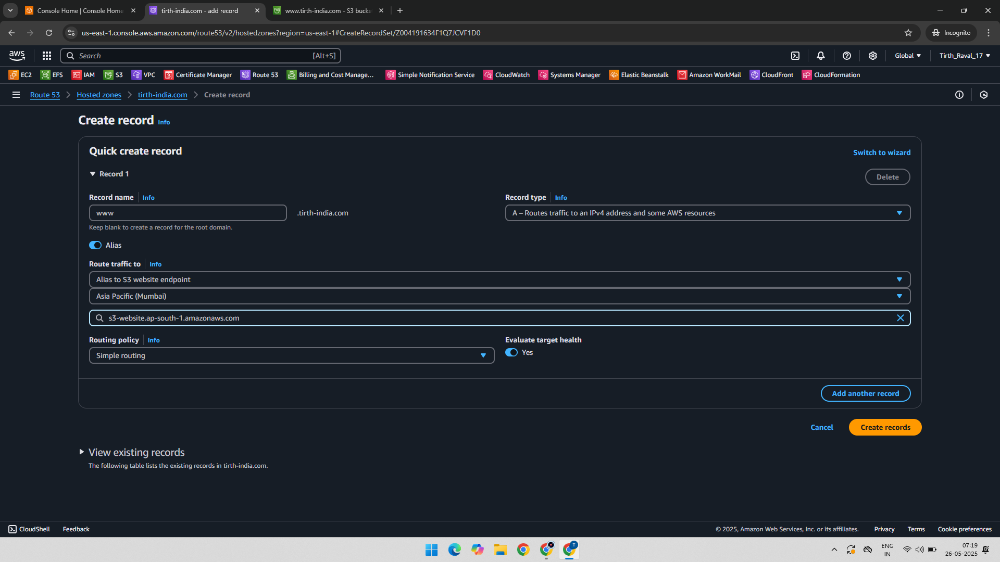
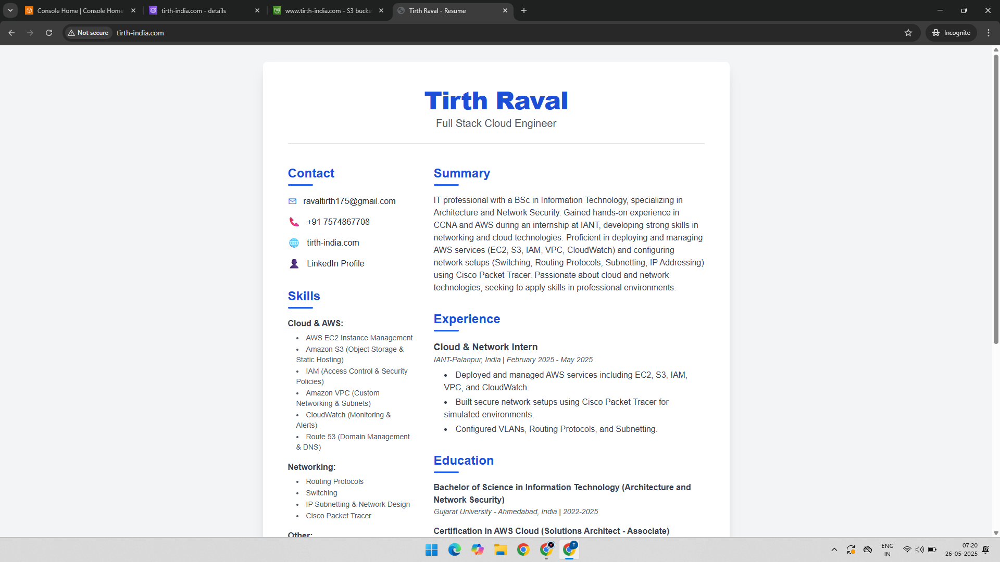
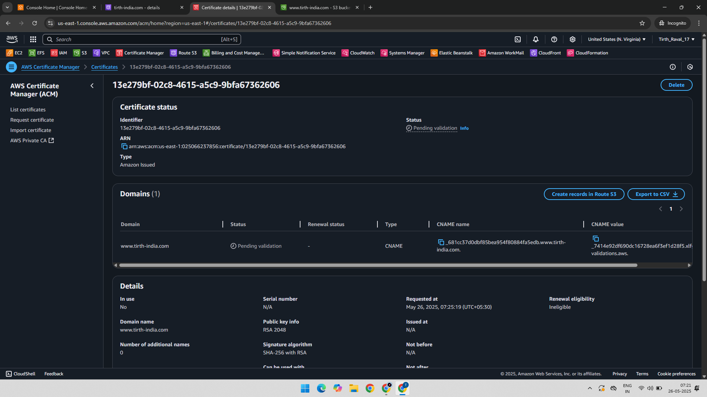
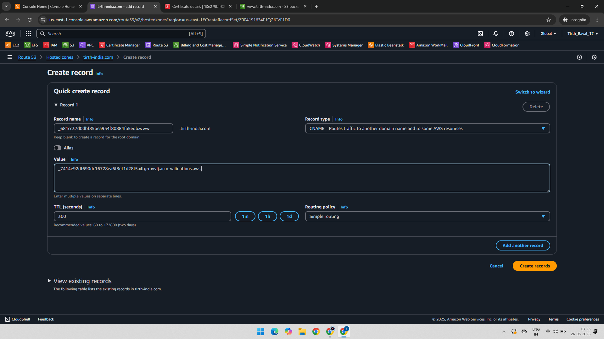
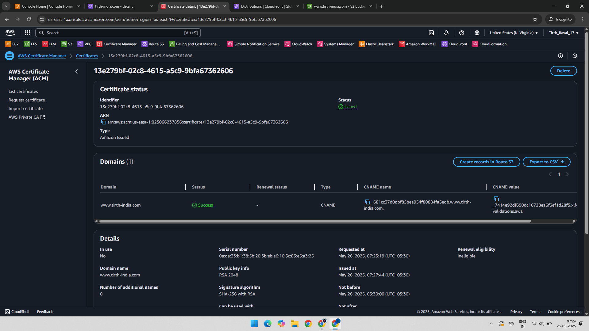
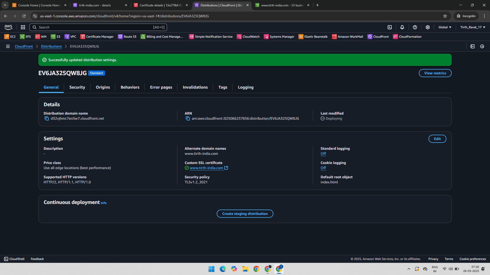
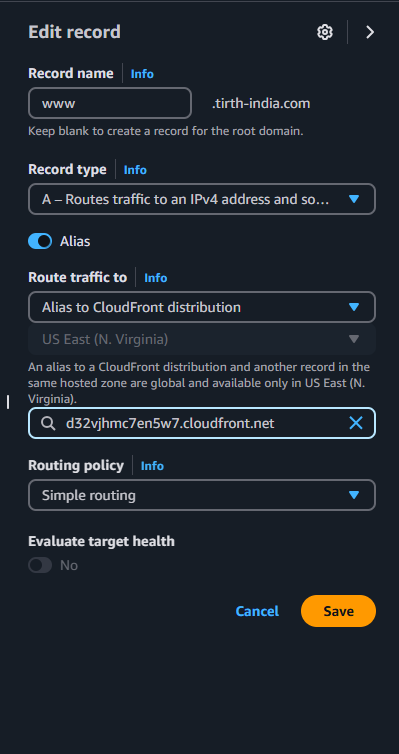
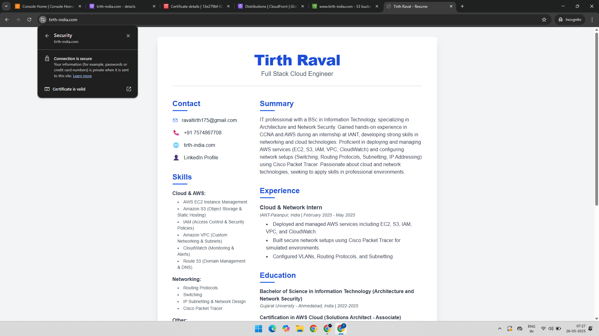

# 🌐 Route 53 Project-1: Static Website Hosting with HTTP & HTTPS

This project demonstrates how to host a static website on **Amazon S3**, point a custom domain using **Amazon Route 53**, and upgrade from **HTTP to HTTPS** using **AWS Certificate Manager (ACM)** and **CloudFront**.

---

### 🧰 Services Used:
- Amazon S3
- Amazon Route 53
- AWS Certificate Manager (ACM)
- AWS CloudFront

### 🔧 Project Goals:
- Host a static website using S3 (HTTP)
- Map a custom domain using Route 53
- Secure the website with HTTPS using ACM and CloudFront

---

## 🛠️ Implementation Steps

### 1. Creating Record For Static Website in Route53

Created static website hosting in S3 and linked it to Route 53 using an alias record.

  

---

### 2. Generate SSL Certificate with ACM

Requested an ACM certificate and verified domain ownership using DNS validation via CNAME records.

  
  

---

### 3. Secure Website via CloudFront

Created a CloudFront distribution using the S3 bucket as the origin and the ACM certificate for HTTPS. Updated DNS to point to CloudFront.

  

---

### 4. Final Result: Secure Website

Website now loads with HTTPS, showing a secure lock icon and certificate in the browser.

---

## 🔐 Final Outcome

| Feature | Status |
|--------|--------|
| Static Website | ✅ Hosted on S3 |
| Custom Domain | ✅ Configured via Route 53 |
| HTTPS Security | ✅ Enabled with ACM + CloudFront |
| DNS Routing | ✅ Managed via Alias and CNAME records |

---

📁 Folder Structure
Route-53-Static-Website-Hosting-HTTP-&-HTTPS/
├── README.md
├── 01-Static-Website-Hosting-Alias.png
├── 02-Static-Website-Hosted-Unsecure.png
├── 03-Certificate-Creation-to-Make-secure-website.png
├── 04-Created-Record-CNAME-name-CNAME-value.png
├── 05-Certificate-Issued.png
├── 06-Created-Cloudfront-Distribution.png
├── 07-Edited-Record-From-S3Endpoint-to-Cloudfront-Distribution.png
└── 08-Website-Secured.png

